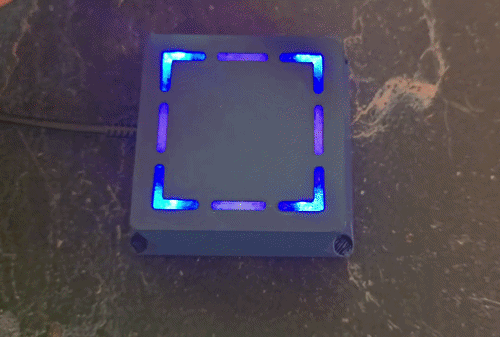
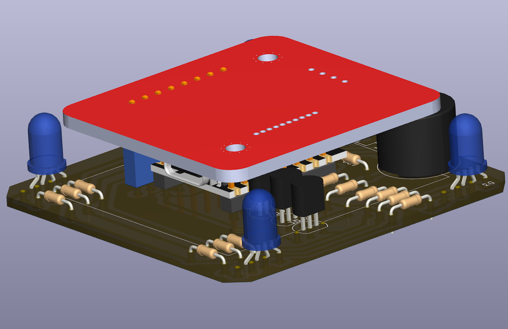

# Prismo – a simple NFC access controller

| Demo | PCB |
| --- | --- |
|  |  |

Prismo is an open-source NFC access controller that you can build yourself for ~500 UAH (~10 USD).
Tap a card to unlock a door or power on a machine — fully self-hosted, MIT-licensed.

<!-- HERO IMAGE — replace with a clean, well-lit photo or render of the assembled device. -->
<!--  -->

<!-- DEMO GIF — ~5s: card tap → LED turns green → relay clicks / door opens. Autoplays in GitHub. -->
<!--  -->

You can use it, for example, to:

- Open a door
- Turn on a machine
- Control whatever you want with an NFC card/key

## Features

- 🟢 **Tap-to-unlock** — present an NFC/RFID card, get instant LED + buzzer feedback and a relay action.
- 🔓 **Build it yourself for ~$10** — off-the-shelf ESP32-C3 + PN532, single-layer PCB.
- 🛠️ **DIY-friendly PCB** — single-layer, etchable at home; a great first soldering project.
- 🏠 **Self-hosted + MQTT** — integrates with Home Assistant or your own backend. No cloud lock-in.
- ⚡ **One-click flashing** — flash a pre-built firmware from your browser, no toolchain required.

## How we test our solution

Every change **Tested on real hardware** — every change runs using a physical Prismo device.
We have a test stand that allows us to verify every change and make sure everything works as expected. For more info read the [ReadMe from blackbox-e2e](/blackbox-e2e/README.md).

## What you need

| Item | Notes |
| --- | --- |
| ESP32-C3 Super Mini | The brains. ~$3. |
| PN532 NFC module | Reads the cards (powered from 3.3 V). |
| Prismo PCB + components | See the [Bill of Materials](hardware/README.md#bom-file). |
| A USB-C cable + a Chrome/Edge browser | For flashing over Web Serial. |
| 2.4 GHz WiFi | The ESP32-C3 is 2.4 GHz only. |

## Quick start

> Full build instructions live in [`hardware/README.md`](hardware/README.md) (PCB + assembly)
> and [`firmware/README.md`](firmware/README.md) (firmware).

1. **Build the board** — etch/order the [single-layer PCB](hardware/README.md), solder the
   components, and connect the PN532 and RGB LED.
2. **Flash it** — open the web flasher in Chrome and click Flash. No toolchain needed.
3. **Connect it** — the device boots, joins your 2.4 GHz WiFi, and announces itself over MQTT.
4. **Add your card** — register the card's UID in the web app; tap to unlock.

## Why are we making Prismo?

We started Prismo because we could not find a simple, low‑cost project that:

- Uses easy hardware
- Uses simple, free software
- Is friendly for beginners

Before building more features, we wrote down what we want from this project.

### General requirements

- You do not need special knowledge to build and use Prismo.
- You do not need any paid software. Everything needed is free.

### Hardware requirements

- The PCB is single‑layer, so it can be made with CNC or a simple toner‑transfer / laser–iron method.
- It should be good as a first soldering project.
- All components should be easy to solder.(We still need to define how to measure “easy to solder”.)
- You do not need special tools to solder or assemble the device.
- All parts should be off‑the‑shelf, easy to buy in common electronics shops.
- The total cost of the device should be low.

### Software requirements

- It should be easy to connect Prismo to other systems (for example, a home automation system or a custom app).
- Users should be able to move away from Prismo to another solution without problems.
- The project should use a common programming language that:
- Many developers already know
- Is easy to understand
- Works well with AI tools

## Project structure

The repository is a monorepo. That means all components of the project live in one place.

- `firmware/` – the software that runs on the Prismo device. This folder has its own README.md.
- `hardware/` – the hardware design files, such as KiCad schematics and PCB layout. This folder has its own README.md.
- `web/` – the web app used to manage devices, register cards, and flash the board with firmware. This app is containerized and can be run locally or on a remote machine.

## Project CI

The project uses GitHub Actions for CI. Every change is built, linted, and — for the firmware — tested on **real ESP32-C3 hardware** running on a Raspberry Pi rig before it lands on `main`. The CI also builds the firmware `*.bin` that the web flasher serves.

## License

Prismo is released under the [MIT License](LICENSE).
