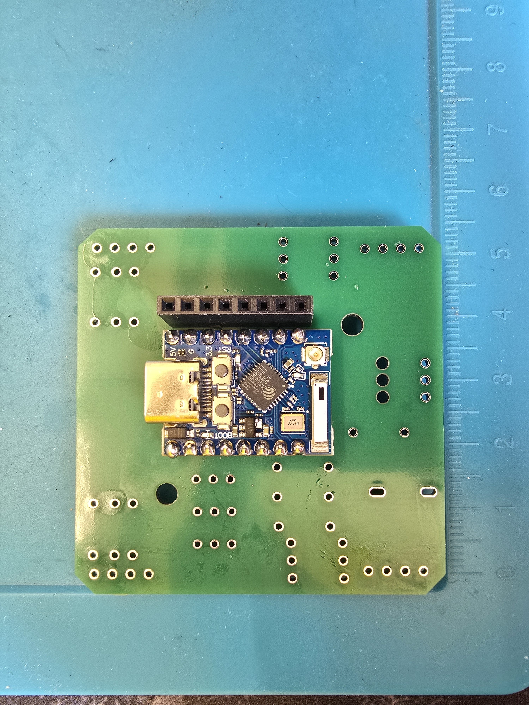
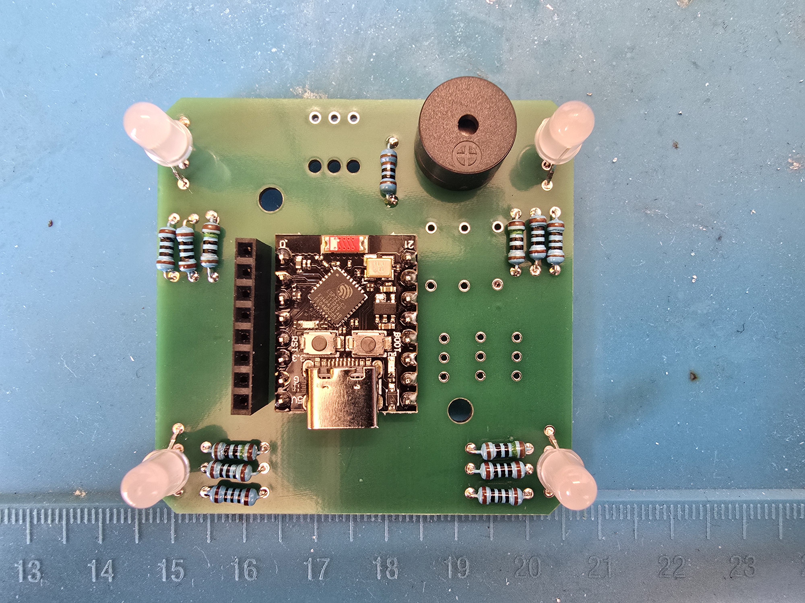
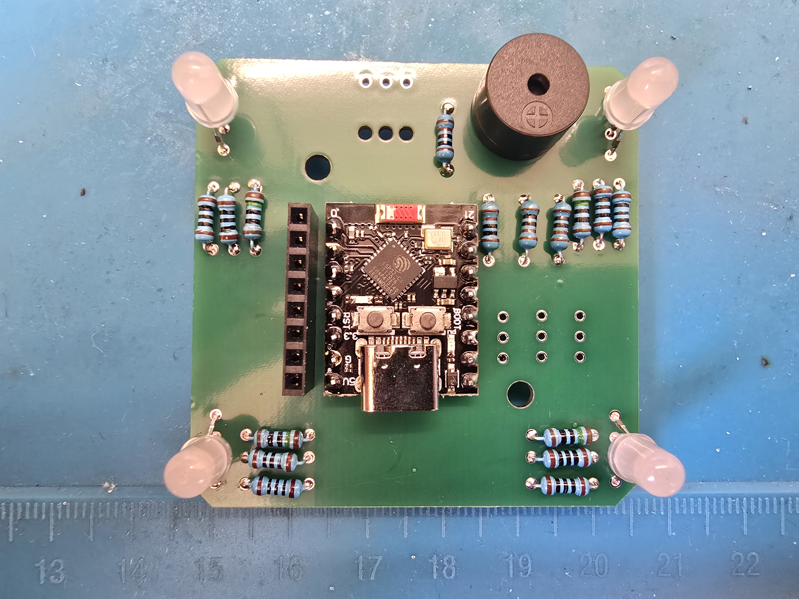
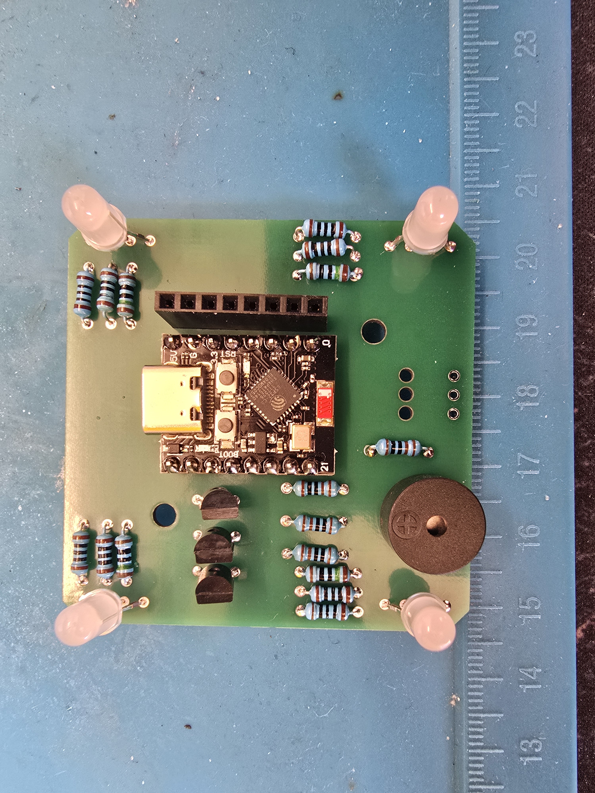

# Solder prismo PCB instruction

[Bom file](https://docs.google.com/spreadsheets/d/12qys1HxDHsoDdR1gj1rnD1MEdx9XqdHl3aNJ3M6xwPU/)

## Solder main components

### Step 1.1

Solder pins for ESP32-C3 Super mini to Prismo PCB

### Step 1.2

Solder the esp32 board

Add a socket for PN532

| Supper mini              | zero pro (alternative board) |
| ------------------------ | ---------------------------- |
|  |     |

So at the moment, you solder all the required components for a working device_, **but we recommend adding the light and sound feature for a better user experience**. The project fully supports both esp32 supper mini and esp32 zero pro

## Add buzzer

The board has a small buzzer for sound effects; this step is also optional. The sound enhances the user experience.

### Step 2.1

Solder the buzzer and its resistor. You can control the buzzer's volume by choosing the right resistor. We recommend a 100 Ω resistor. For reference, the 1000 Ω resistor makes the buzzer really quiet, so you can hear it only in completely silent environments.

## Solder light components

The light line connects to the 5V line and is controlled via 3 transistors. 

### Step 3.1

Solder four RKGB LED diodes. Use diodes with a common cathode. Match the long (cathode) pin on the diode with the board GND. The other side of the board is labeled RKGB; the letters match the LED diode pinout.

### Step 3.2

Solder four 150 Ω resistors for the red line

### Step 3.3

Solder four 100 Ω resistors for the green and blue lines

### Step 3.4 

Solder three 1000 Ω resistors to the light board output.

### Step 3.5

Solder three BC337 transistors

## Step 4

Solder the male pins to the PN532 module

So congrats, you've done the soldering part. Now you can visit our website app to flash your board [here](https://prismo.nu31.space/)
