# Solder prismo PCB instruction

[Bom file](https://docs.google.com/spreadsheets/d/12qys1HxDHsoDdR1gj1rnD1MEdx9XqdHl3aNJ3M6xwPU/)

## Solder main components

### Step 1.1

Solder ESP32-C3 Super mini to Prismo PCB

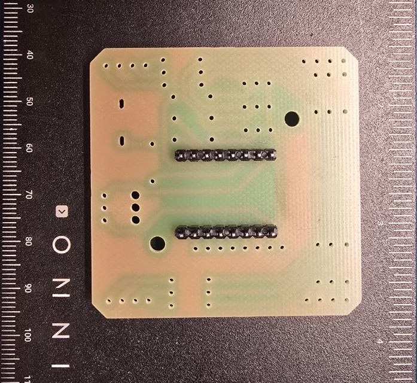

### Step 1.2

Solder the female pins nearby.

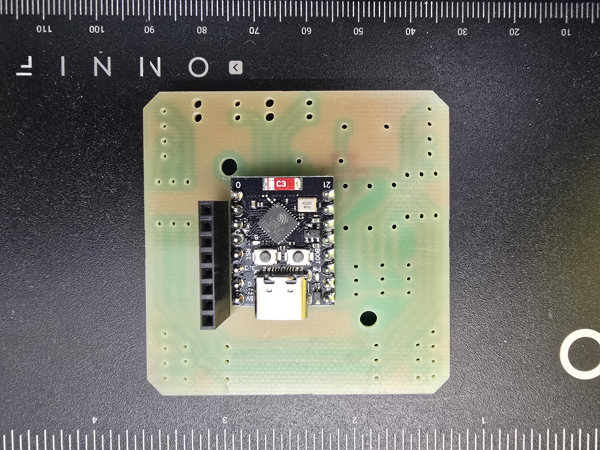

Add a socket for PN532

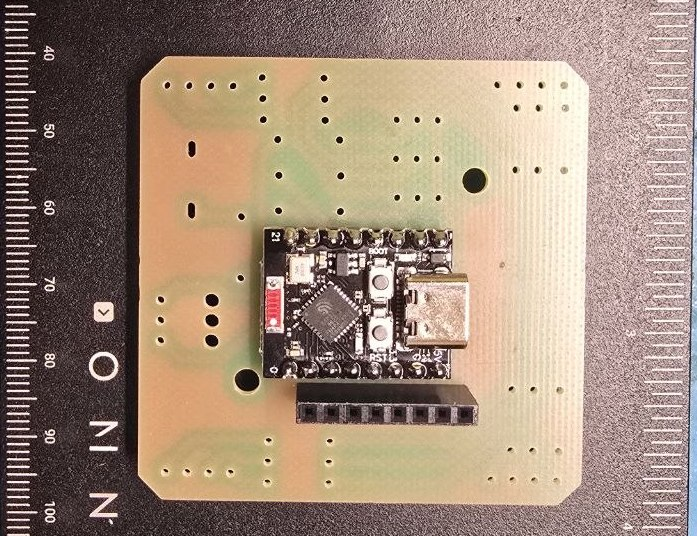

_So at the moment you solder all the required components for a working device_, **but we recommend adding the light and sound feature for a better user experience**

## Solder light components

The light line connects to the 5V line and is controlled via 3 transistors. 

### Step 2.1 

Solder three 1kOm resistors to the light board output.

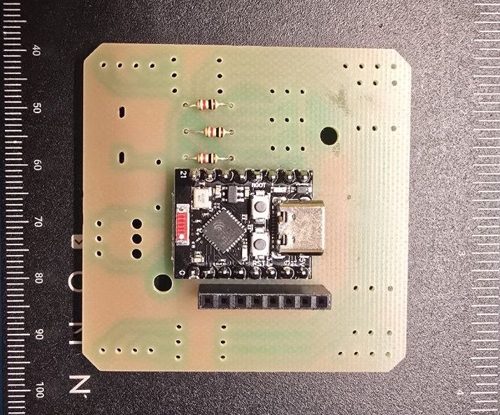

### Step 2.2

Solder three BC337 transistors

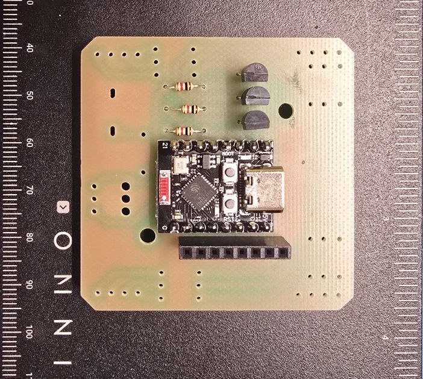

### Step 2.3

Solder four 150 Ω resistors for the red line

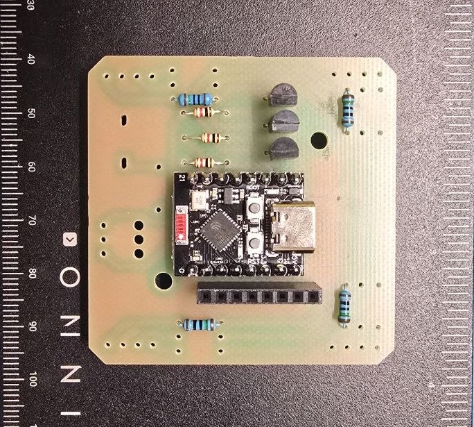

### Step 2.4

Solder four 100 Ω resistors for the green and blue lines
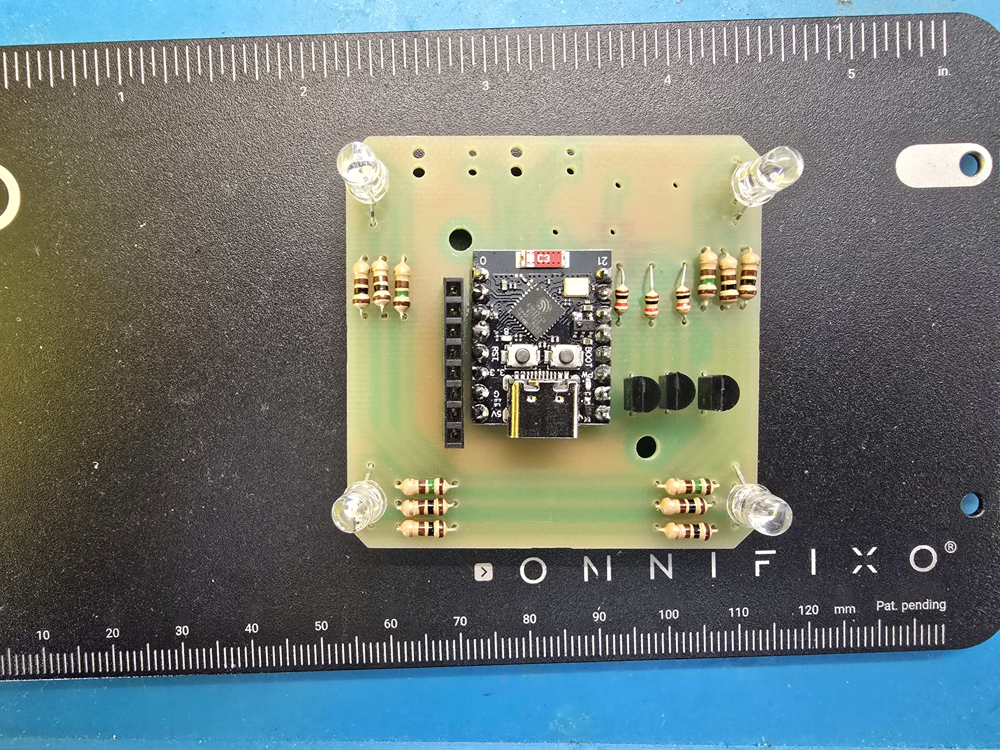

### Step 2.5

Solder four RKGB LED diodes. We use the diodes with a common cathode. Match the long (cathode) pin on the diode with the board GND.

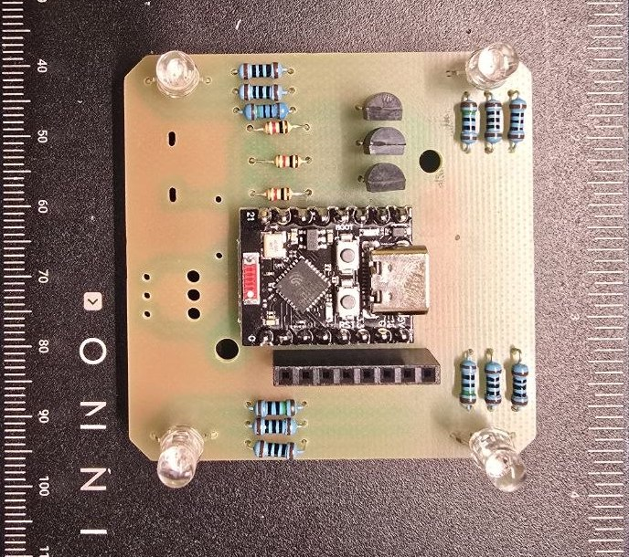

## Add buzzer

The board has a small buzzer for sound effects; this step is also optional. The sound enhances the user experience.

### Step 3.1

Solder the resistor for the buzzer. You can control the buzzer's volume by choosing the right resistor. 
Our recommendation is a 510Om. For reference, the 1k resistor makes the buzzer really quiet, so you can hear it only in completely silent environments.

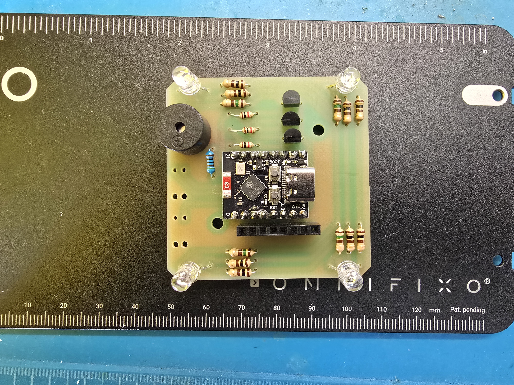

### Step 3.2

Solder the buzzer. The positive pin of the buzzer is located near the resistor you solder in step 3.1 

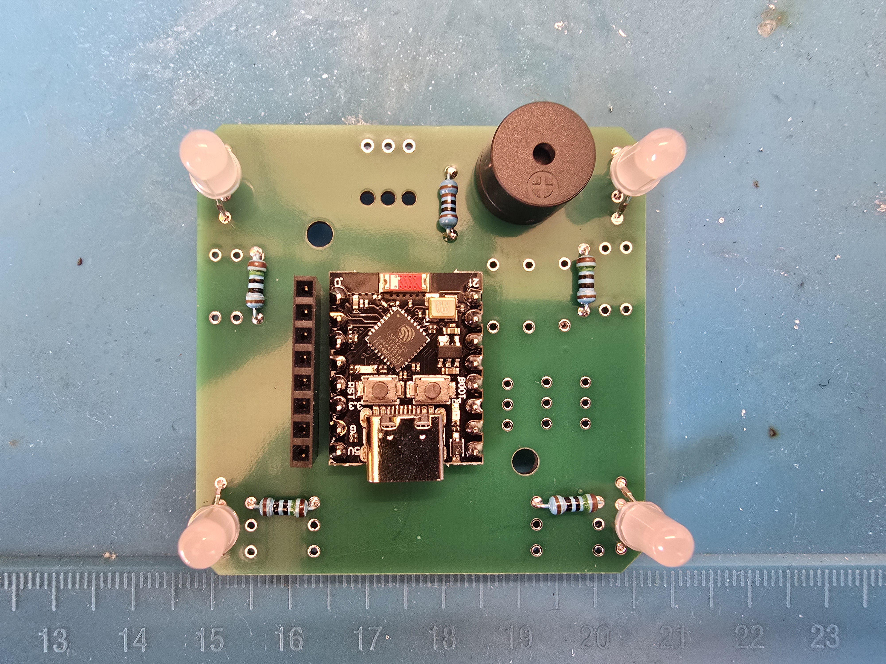

## Step 4

Solder the male pins to the PN532 module

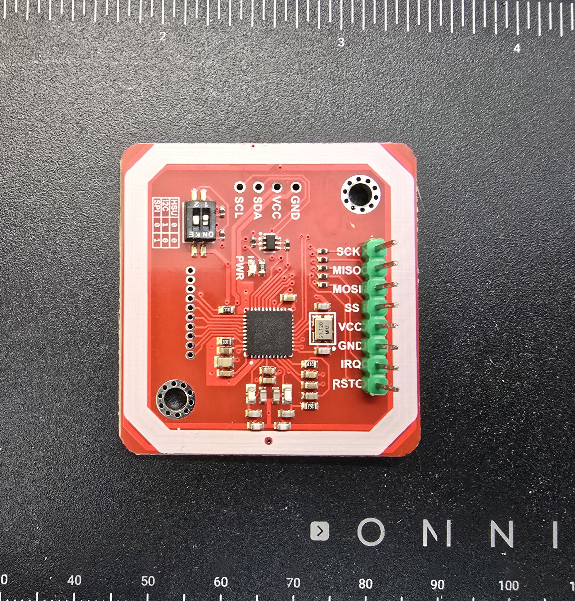

So congrats, you've done the soldering part. Now you can visit our website app to flash your board [here](https://prismo.nu31.space/)
