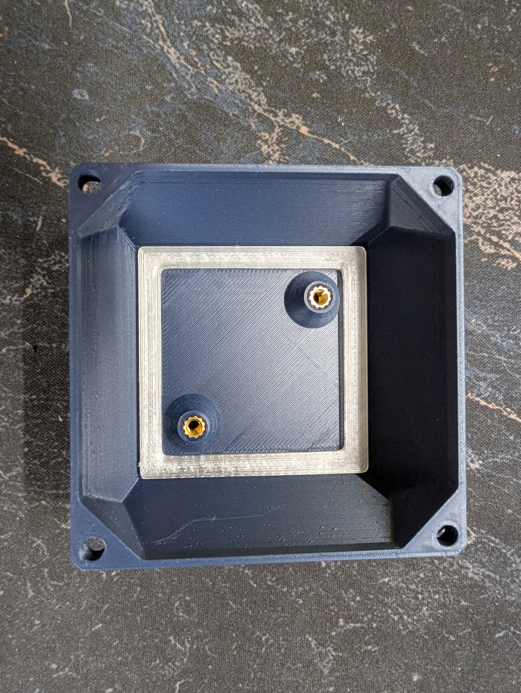
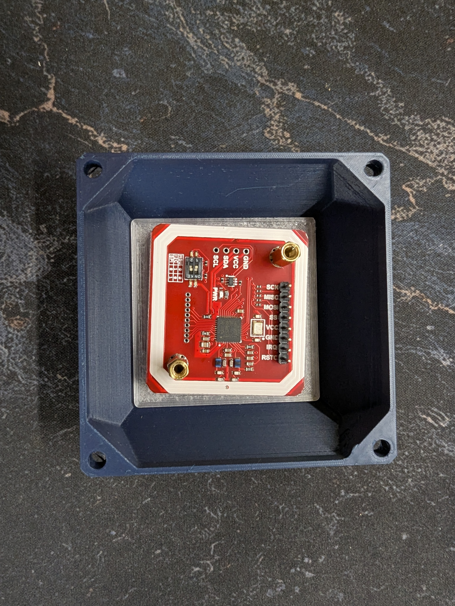
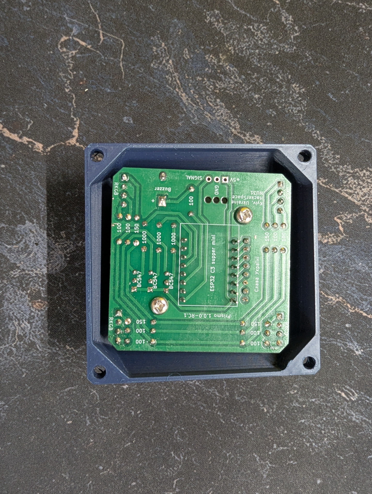

# Solder prismo PCB instruction

[Bom file](https://docs.google.com/spreadsheets/d/12qys1HxDHsoDdR1gj1rnD1MEdx9XqdHl3aNJ3M6xwPU/)

## Solder main components

## Main components soldering

### Step 1.1

Solder pins for ESP32-C3 Super mini to Prismo PCB

### Step 1.2

Solder the ESP32 board

Add a socket for PN532

| Super mini              | Zero Pro (alternative board) |
| ------------------------ | --------------------------- |
|  |    |

At this point, you solder all the required components for a working device, **but we recommend adding the light and sound feature for a better user experience**. The project fully supports both ESP32 Super Mini and ESP32 Zero Pro

## 2. Soldering audio - add buzzer

The board has a small buzzer for sound effects; this step is also optional. The sound enhances the user experience.

### Step 2.1

Solder the buzzer and its resistor. You can control the buzzer's volume by choosing the right resistor. We recommend a 100 Ω resistor. For reference, the 1000 Ω resistor makes the buzzer really quiet, so you can hear it only in completely silent environments.

## Solder light components

The light line connects to the 5V line and is controlled via 3 transistors. 

### Step 3.1

Solder four RKGB LED diodes. Use diodes with a common cathode. Match the long (cathode) pin on the diode with the board GND. The other side of the board is labeled RKGB; the letters match the LED diode pinout.

### Step 3.2

Solder four 150 Ω resistors for the red line

### Step 3.3

Solder four 100 Ω resistors for the green and blue lines

### Step 3.4 

Solder three 1000 Ω resistors to the light board output.

### Step 3.5

Solder three BC337 transistors

## Solder PN532 module

## Step 4

Solder the male pins to the PN532 module

So congrats, you've done the soldering part. Now you can visit our website app to flash your board [here](https://prismo.nu31.space/)

## Assemble

### Step 5.1

Add two heat inserts into 3d printed housing and add the diffuser; use glue for permanent attachment.

### Step 5.2

Attach the PN532 using two PCB standoffs

### Step 5.3

Add the main PCB and fix it with two M3 bolts

